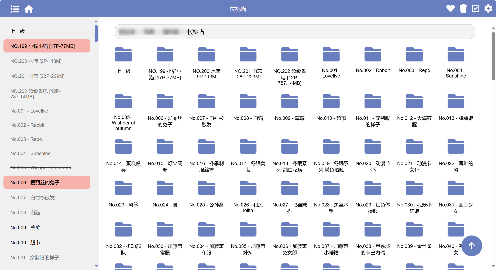

# 预览

# 特性
1. 文件夹式浏览，瀑布流显示图片；
2. 文件夹级别已读、收藏和删除标记；
3. 联动stash实现图片、视频收藏；
4. 实现简易的登录界面；
5. 适配移动端；
6. 支持docker部署；
7. 实现收藏图片展示、收藏文件夹展示；
# 部署
docker run --restart=always -v /app/data:/app/data -e base_url=[stash url] -e username=[username] -e password=[password] -e api_key=[stashApi] -p 8000:8000 -d unimrq/stash-folder-view
# TODO
1. 优化悬浮按钮逻辑；完成
2. 瀑布流显示收藏按钮；完成
3. 收藏文件及文件夹在首页显示；完成
4. 登录功能完善；完成
5. 文件夹图标列表功能；完成
6. 左侧自动定位并高亮显示当前文件夹；完成
7. 分离收藏页面；完成
8. 新增收藏文件夹显示页面；完成
9. 新增左侧目录固定功能；完成
10. 新增左侧目录缩起已读功能；完成